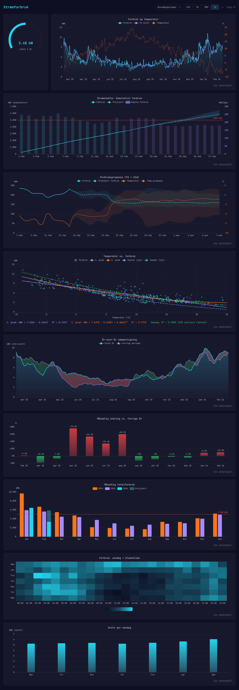

# Energy Dashboard

Personlig dashboard for strømforbruk. Henter timedata fra [Tibber](https://tibber.com/) og utetemperatur fra [Frost API](https://frost.met.no/) (met.no), lagrer alt i [Supabase](https://supabase.com/) (PostgreSQL), og visualiserer med [ECharts](https://echarts.apache.org/). Hostet på [Vercel](https://vercel.com/). Grafana-inspirert mørkt tema med JetBrains Mono.

Støtter flere hjem (Tibber homes) med individuell temperaturstasjon og koordinater for prognose.



## Hva viser det?

**Alle perioder (24t, 7d, 28d, 1y):**
- **Gauge** med gjennomsnittsforbruk for valgt periode. I 24t-visning: avvik fra sesongmodellens forventning
- **Linjegraf** med forbruk, rullende snitt og utetemperatur (dual y-akse)
- **Kumulativ strømstøtte** (kun individuelle hjem): kumulativt forbruk denne måneden med projisert total mot 5000 kWh-grensen, basert på temperaturprognose
- **Forbruksprognose**: 7 dager tilbake + 21 dager fremover med usikkerhetsbånd, basert på met.no-prognose
- **År-over-år sammenligning** med sentrert rullende snitt (±7 dager) og rød/grønn fyll som viser om forbruket har gått opp eller ned
- **Månedlig endring** i prosent sammenlignet med tilsvarende måned året før
- **Månedlig totalforbruk** per år som gruppert stolpediagram (jan–des, maks 2 foregående år + inneværende) med projisert rest for inneværende måned

**Kun årsvisning (365d):**
- **Scatter plot** med temperatur vs. forbruk, lineær/kvadratisk/sesongregresjon, vinter- og sommerkurver
- **Heatmap** med snittforbruk per ukedag og klokketime
- **Snitt per ukedag** som bar chart

## Regresjonsmodell

Forbruksprediksjon bruker en robust sesongmodell:

```
kWh = a + b·T + c·T² + d·sin(2π·doy/365) + e·cos(2π·doy/365)
```

- Fourier-leddene fanger sesongavhengig forbruk (f.eks. basseng om sommeren) som temperatur alene ikke forklarer
- MAD-basert outlier-fjerning filtrerer bort elbil-ladingstopper (typisk 2–4% av datapunktene)
- Modellen beregnes fra siste 1 års timedata og brukes av alle prognosegrafer + gauge-avvik

## Arkitektur

```
GitHub Actions (cron :15 hver time)
    ↓
/api/collect.js (Vercel serverless, henter siste 72t)
    ↓ Tibber GraphQL API → forbruksdata
    ↓ Frost API (met.no) → temperaturdata (per hjem-stasjon)
    ↓
Supabase (PostgreSQL, upsert)
    ↓
Frontend spør Supabase direkte (RLS + auth)
    ↓ /api/forecast.js → temperaturprognose fra met.no
    ↓
Ren HTML + vanilla JS + ECharts
```

Ingen build step, ingen bundler, ingen React. Bare HTML, vanilla JavaScript (ES modules) og serverless functions (CommonJS).

## Tech stack

| Hva | Tjeneste |
|-----|----------|
| Hosting + serverless | Vercel (free tier) |
| Database | Supabase PostgreSQL (free tier) |
| Autentisering | Supabase Auth (e-post/passord) |
| Strømdata | Tibber GraphQL API |
| Temperatur (historisk) | Frost API (met.no, konfigurerbar stasjon per hjem) |
| Temperatur (prognose) | met.no Locationforecast + Subseasonal |
| Grafer | ECharts (CDN) |
| Styling | Tailwind CSS (CDN) |
| Cron | GitHub Actions |

## Oppsett

### 1. Kontoer

Opprett kontoer hos [Vercel](https://vercel.com/), [Supabase](https://supabase.com/), [Tibber Developer](https://developer.tibber.com/) og [Frost (met.no)](https://frost.met.no/).

### 2. Database (Supabase)

Opprett tabellene i Supabase SQL Editor:

```sql
CREATE TABLE homes (
  id TEXT PRIMARY KEY,           -- Tibber home ID
  name TEXT NOT NULL,            -- Visningsnavn ("Hjemme", "Hytta")
  sort_order INT DEFAULT 0,
  lat NUMERIC,                   -- Breddegrad (for temperaturprognose fra met.no)
  lon NUMERIC,                   -- Lengdegrad (for temperaturprognose fra met.no)
  frost_station TEXT              -- Frost-stasjon for historisk temperatur (default: SN17280)
);

CREATE TABLE consumption (
  home_id TEXT NOT NULL REFERENCES homes(id),
  timestamp TIMESTAMPTZ NOT NULL,
  consumption_kwh NUMERIC,
  outside_temp_c NUMERIC,
  PRIMARY KEY (home_id, timestamp)
);
CREATE INDEX idx_consumption_timestamp ON consumption (timestamp);
```

### 3. Legg inn hjem

Finn dine Tibber home IDs via [Tibber API Explorer](https://developer.tibber.com/explorer) og legg dem inn i `homes`-tabellen:

```sql
INSERT INTO homes (id, name, sort_order, lat, lon, frost_station) VALUES
  ('xxxxxxxx-xxxx-xxxx-xxxx-xxxxxxxxxxxx', 'Hjemme', 1, 59.91, 10.75, 'SN17280'),
  ('yyyyyyyy-yyyy-yyyy-yyyy-yyyyyyyyyyyy', 'Hytta',  2, 58.15, 8.00,  'SN38140');
```

- `lat`/`lon`: koordinater for temperaturprognose (met.no). Finn via Google Maps
- `frost_station`: nærmeste Frost-stasjon for historisk temperatur. Finn via [Frost stasjonsliste](https://frost.met.no/sources/v0.jsonld). Utelat for å bruke default SN17280

### 4. Row Level Security

Aktiver RLS på begge tabellene og legg til policies:

```sql
ALTER TABLE homes ENABLE ROW LEVEL SECURITY;
ALTER TABLE consumption ENABLE ROW LEVEL SECURITY;

CREATE POLICY "Autentiserte kan lese homes" ON homes FOR SELECT TO authenticated USING (true);
CREATE POLICY "Autentiserte kan lese consumption" ON consumption FOR SELECT TO authenticated USING (true);
```

### 5. Auth

Opprett en bruker i Supabase Auth (Authentication → Users → Add User).

### 6. Environment variables (Vercel)

Sett i Vercel → Settings → Environment Variables:

```
TIBBER_API_TOKEN       # Fra developer.tibber.com
SUPABASE_URL           # Supabase prosjekt-URL
SUPABASE_SERVICE_KEY   # Supabase service_role key (kun server-side)
CRON_SECRET            # Hemmelig nøkkel for å sikre collect-endepunktet
FROST_CLIENT_ID        # Fra frost.met.no
```

### 7. GitHub Actions

Sett opp repository secrets/variables:
- **Secret**: `CRON_SECRET` – samme verdi som i Vercel
- **Variable**: `COLLECT_URL` – `https://din-app.vercel.app/api/collect`

Workflowen (`collect.yml`) har en ekstra `keepalive`-jobb som re-aktiverer seg selv via `gh workflow enable` hver kjøring. GitHub deaktiverer ellers planlagte (cron) workflows etter 60 dager uten repo-aktivitet (commits) – keepalive-jobben hindrer dette uten tredjepartskode eller tomme commits. Krever ingen ekstra konfigurasjon.

### 8. Deploy

```bash
git push  # Vercel bygger automatisk fra main
```

### 9. Backfill

Hent historisk data (Tibber har 1–2 år tilbake):

```bash
# Alle hjem:
curl -X POST "https://din-app.vercel.app/api/collect?hours=100000" \
  -H "x-cron-secret: din-nøkkel"

# Spesifikt hjem:
curl -X POST "https://din-app.vercel.app/api/collect?hours=100000&home=<TIBBER_HOME_ID>" \
  -H "x-cron-secret: din-nøkkel"
```

## Vibe-kodet

Dette prosjektet er nær 100 % vibe-kodet med [Claude Code](https://docs.anthropic.com/en/docs/claude-code). Alt av kode -- frontend, backend, databehandling, grafer og GitHub Actions-oppsett -- er skrevet av Claude gjennom naturlig dialog på norsk. Det eneste som er gjort manuelt er opprettelse av kontoer hos de ulike tjenestene og konfigurasjon av API-nøkler.
